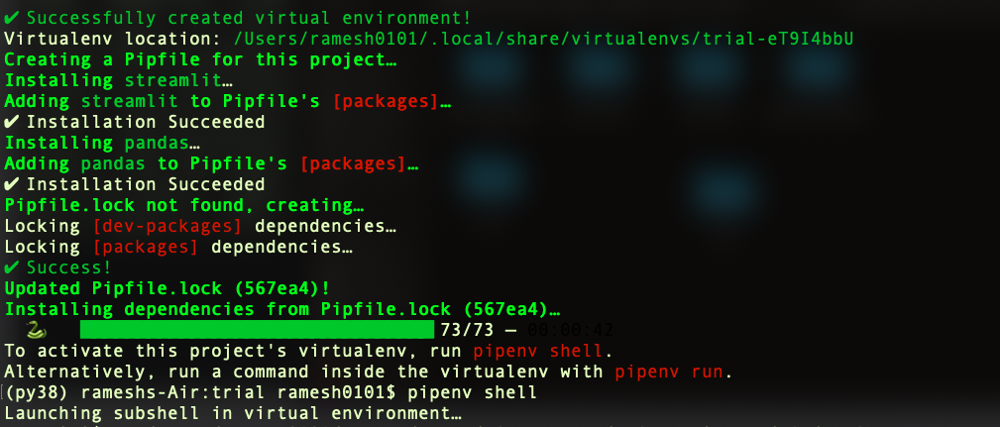
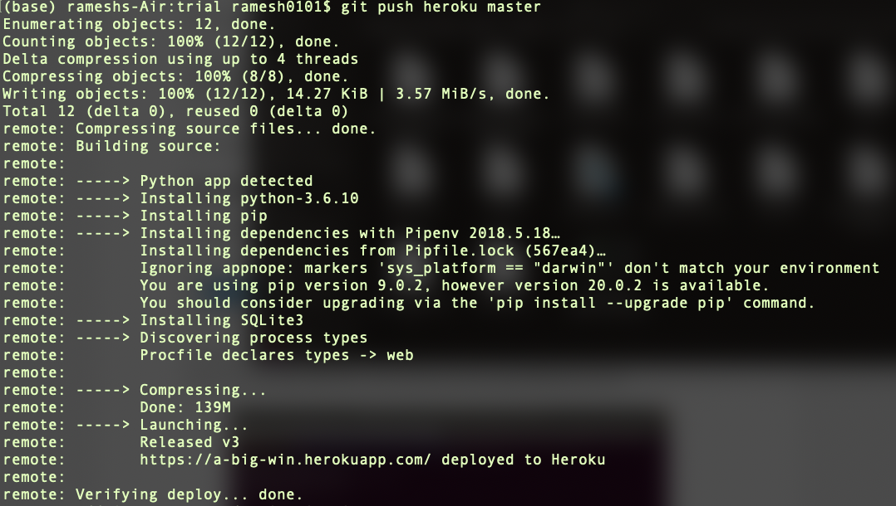

# INFO 7374 | Algorithmic Digital Marketing | Final Project

Project Report Document 
[Link](https://docs.google.com/document/d/17LH2tHUcMupo8Gp4IdkbEcm5pzd33Bxjc8hDaVvTJo0/edit#heading=h.nh1djjdrpyqf) 
Web Application [Link](https://yt-sponsored-vid.herokuapp.com/)

# Project Title

### YouTube Channel based ad sponsorship

# Tools Used

* Python and it's libraries
* Streamlit for Visualizations
* Heroku to deploy the web based application on cloud

# Depoloyment of Visualization application on cloud using Heroku

To make the dashboard visualizations more easy to access, deploying it on the cloud is the best option.

We have used Heroku as it has only a few steps and requires minimum amount of coding. Following are the steps to achieve that using GitHub:

* Create an Account on [Heroku](https://signup.heroku.com)
* Install the [Heroku CLI](https://devcenter.heroku.com/articles/getting-started-with-python#set-up) and setups
* Create a Git Account on [GitHub](https://github.com/join?source=header-home)
* Create A Repository for your app
* Clone Your App locally``git clone yourreponame``
* Install the library dependencies using the command such as ``pipenv install pandas streamlit numpy seaborn scikit-learn matplotlib`` 

* Run the virtual environment locally ``pipenv shell``
* Check if the app is running error free in virtual environment ``pipenv run streamlit run yourfilename.py``
* Create the ``requirements.txt`` file with the command ``pipenv run pip freeze > requirements.txt``
* Create the ``setup.sh`` file. If you want to by pass your creadentials then use this  ``mkdir -p ~/.streamlit/`` 
``echo "\`` 
``[server]\n\`` 
``headless = true\n\`` 
``port = $PORT\n\`` 
``enableCORS = false\n\`` 
``\n\`` 
``" > ~/.streamlit/config.toml`` 
* For without credentials  ``mkdir -p ~/.streamlit/`` 
``echo "\`` 
``[general]\n\`` 
``email = \"youremail@domain.com\"\n\`` 
``" > ~/.streamlit/credentials.toml`` 
``echo "\`` 
``[server]\n\`` 
``headless = true\n\`` 
``enableCORS=false\n\`` 
``port = $PORT\n\`` 
``" > ~/.streamlit/config.toml``
* Compse the ``Procfile`` with the code ``web: sh setup.sh && streamlit run yourapp.py``
* Go to the local environment and push all the files to git repository
 * ``git add .``
 * ``git commit -m "your-message"``
 * ``git push``
* Type the command to login to heroku from the CLI - ``heroku login``
* Have the required files ready - ``setup.sh``, ``Procfile``
* Create A heroku app from the CLI - ``heroku create yourappname`` will help you 
* Deploy by pushing to heroku - on CLI ``git push heroku master``
* Finally the successful deployment would look something like this 

Once your app is deployed on the cloud you can copy the url and use it by simply pasting in on any browser and it should work as expected.

The [link](https://yt-sponsored-vid.herokuapp.com/) to our web application.

# Test Dataset
Dataset [Link](https://github.com/atulyasharma/admproject/raw/master/YouTube.csv) 
The test dataset 'YouTube.csv' is used to modify the features and then gain insghts useful for choosing the YouTube suitable for the user.

Our initial dataset had 241,119 rows to work with 17 Columns.

The following is the description of the test dataset:

* Video_id: Unique ID of the Video
* Trending_date: The date when the video got on YouTube’s Trending list
* Title: Name of the video as published on YouTube
* Channel_title: The Name of the channel on which the video was uploaded
* Category_id: Unique ID given to the category of the video
* Publish_time: Date and time when the video was published on YouTube
* Tags: Keywords used while uploading video to attract more audience
* Views: Number of views on the video when it go into the trending list
* Likes: Number of likes on the video on the day of it trending
* Dislikes: Number of dislikes on the video on the day of it trending
* Comment_count: Number of comments on the video
* Thumbnail_link: URL of the thumbnail used on the video
* Comments_disabled: Whether the comments were disabled or not
* Ratings_disabled: Whether or not the ratings on the video was disabled
* Video_error_or_removed: Whether the video was removed or had error during playback
* Country: Name of the country that channel belongs
* Category: Category name of the video (eg- Pranks, gadget_reviews, movie_reviews)

# Model Implementation

* Natural Language Processing to conduct Sentiment Analyis
* K-Means Clustering to get the most popular channels based on different parameters

## Natural Language Processing

It is an Artificial Intelligence based Machine Learning model that helps the user extract useful meaning from human language. NLP has been used in our project to study the tags of the videos and helps in generating a sent_score which can helps in getting an overview of the impact the video has on its audience.

## K-Means Clustering

K-Means clustering is an unsupervised machine learning algorithm primarily used to create partitions from the data within the dataframe based on different parameters. These partitions have a mean point called the Centroid.

For the current use case, K-Means helped us cluster the videos from the dataset into 3 different clusters based on their popularity percentage and category.

# Trend Metric

Views, likes, dislikes, like_percentage, sent_score, popular are the columns that hold immense importance to show how influential or trendy that channel is. The higher these numbers are the higher will be the trend metric. Thus, Trend Metric is a combination of the above columns scaled between 0 and 1. it is different for each month for different channels.

It is an outcome of the following formula:

views + like_percentage + popular + sent_score

It helps in getting scaled ROI after sponsorering a channel every month of the year.

# Return On Investment

ROI in our case is scaled according to the length of the YouTube sponsorship between the channel and the marketer. It can be calculated using the following formula:

Scaled ROI = Trend_Metric * 9 ** n

here, n is the index number

# Visualizations

For generating dashboards after performing the analysis, we use Streamlit, an open source app framework for machine learning and data science.

Streamlit is friendly and intuitive as it is coded in python with just a few extra lines of code.

It can be run from the local system.

The following guidelines can help you while runnning a streamlit application:

1. Create .py file that has all the code required for the visualizations (in our case it can be either Integrated.py and Trend_Metric_Channels.py)

2. Open Command Line and pip install streamlit
3. Navigate to the folder consisting the .py file
4. streamlit run Integrated.py / streamlit run Trend_Metric_Channels.py
5. Open browser and copy the url
